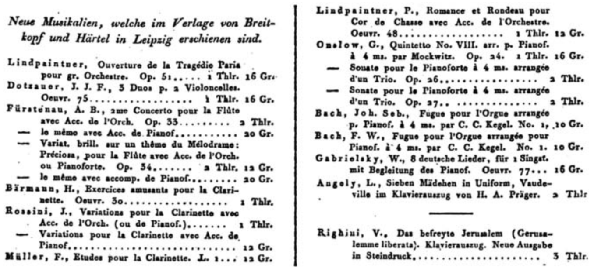

---
output:
  html_document:
    css: "StyleSheet.css"
title: "Prices of Music at Breitkopf & Härtel"
---
<h3 style="text-align: center;">*Publication Lists from the* Intelligenz-blatt zur Allgemeine musikalische Zeitung</h3>

{width=25%}

<h4 style="text-align: center;">Derek R. Strykowski, *University at Buffalo*</h4>

&nbsp;  

###### [The&nbsp;Publication&nbsp;Lists](index.rmd)&nbsp;&nbsp;&nbsp;&nbsp; **[Introduction&nbsp;to&nbsp;the&nbsp;Project](Introduction.rmd)**&nbsp;&nbsp;&nbsp;&nbsp;[Acknowledgements](Acknowledgements.rmd)

###### [Download this introduction (PDF)](http://dx.doi.org/10.17613/M6SX64911)

&nbsp;

THE FIRM OF BREITKOPF & HÄRTEL STOOD at the center of the nineteenth-century market for printed sheet music, a position of prestige and power that it had occupied since the middle of the previous century. Its founder, Bernhard Christoph Breitkopf, had purchased the company in 1719 from Johann Caspar Müller, whose family had been active in Leipzig since the sixteenth century (Hase, 112). The firm did not distinguish itself as a publisher of sheet music until after 1750, however, when technological innovations in the field of moveable type allowed it to dominate the marketplace (Hortschansky, 156). Gottfried Christoph Härtel joined the firm in 1795. Under his leadership, the firm continued to prosper. By the early nineteenth century, its sales agents operated throughout the European continent (Scherer, 157). Breitkopf & Härtel had become the publisher of choice for many of the era’s most prominent composers, trusted to sell authoritative editions and arrangements of their music to a middle class eager to experience—and participate in—the refinements of high musical culture.

Breitkopf & Härtel founded a weekly newspaper called the *Allgemeine musikalische Zeitung* (General Musical Newspaper) on October 3, 1798, and issued it without interruption for more than fifty years. (A digital facsimile is available from the Münchener DigitalisierungsZentrum at [http://digitale-sammlungen.de/](http://digitale-sammlungen.de/).) Initially, the start of a new volume was reckoned from the Feast of St. Michael on September 29. The publisher later aligned the volumes with the start of the calendar year by extending the length of Vol. 12 through December of 1810 rather than September. The entirety of the *Allgemeine musikalische Zeitung* was devoted to items of musical interest, but until 1839, announcements of a commercial nature appeared within the *Intelligenz-blatt zur Allgemeine musikalische Zeitung* (Intelligence Page of the General Musical Newspaper), an occasional supplement. The *Intelligenz-blatt* is organized according to the same volume numbers that govern the *Allgemeine musikalische Zeitung.* Issues are numbered independently, however, because the supplement appeared less frequently than did the newspaper itself. From October of 1798 through December of 1838, the year of the its discontinuation, Breitkopf & Härtel published 568 issues of the Intelligenz-blatt—an average of about 14 issues per year. Readers therefore received a new issue of the supplement about once per month, appended to every third or fourth issue of the larger newspaper.

The *Intelligenz-blatt* provided a conspicuous forum for all manner of adver- tisements, notices of publication, and similar announcements. Publication lists were regularly submitted from many of the leading firms, including Friedrich Hofmeister, C. F. Peters, and Nikolaus Simrock, yet only those of Breitkopf & Härtel itself appear within every single volume. Not only a publisher but also a retailer, Breitkopf & Härtel in fact printed two types of publication lists. One advertised items that the firm itself had published, while another advertised items that Breitkopf & Härtel had merely arranged to distribute on behalf of other firms. For example, an issue from 1825 (vol. 27, no. 7) includes a list of “new sheet music, issued by the firm of Breitkopf and Härtel in Leipzig,” followed by a list of “new sheet music from various firms, which may be had through Breitkopf and Härtel” (31–32). The data set is limited to items found in the first type of announcement.

&nbsp;

{width=75%}  

##### A publication list from the *Intelligenz-blatt zur Allgemeine musikalische Zeitung* 27, no. 7 (1825): 31–32.

&nbsp;

Breitkopf & Härtel released a total of 159 publication lists to advertise the firm’s own sheet music between October of 1798 and December of 1838, or an average of about four lists per year. (The total number of publication lists given here includes one list that appeared not within the *Intelligenz-blatt* but rather within an “Intelligenzen” section of the *Allgemeine musikalische Zeitung* 40, no. 9 (1838), 151–52. The broader significance of the newspaper’s “Intelligenzen” section is explained below.) Just as readers could expect that a new issue of the *Intelligenz-blatt* would supplement every third or fourth issue of the *Allgemeine musikalische Zeitung,* they could expect that a publication list from Breitkopf & Härtel would appear within every third or fourth issue of the *Intelligenz-blatt.* The lists include a handful of musical editions that have been marked by the publisher with an asterisk. The first editions to bear this distinction appear in a list from 1810 (vol. 12, no. 4) along with a note to explain that the publisher had acquired the works from the firm of Rudolph Werkmeister in Oranienburg: “Die mit * bezeichneten Werke haben wir aus dem Werkmeisterschen Verlage an uns gebracht” (16). All asterisked editions have been excluded from the data set, even though the few such editions to be found in later volumes are not accompanied by an explanatory note.

Although a majority of the advertised editions are indeed sheet music, Breitkopf & Härtel sometimes used the publication lists to announce the availability of related offerings. For example, a list from 1812 (vol. 14, no. 4) advertises not only the firm’s sheet music but also a theoretical treatise by Johann Gottfried Schicht and the portraits of five prominent musicians (15–18). The treatise is entitled *Grundregeln der Harmonie nach dem Verwechslungssystem*; the portraits depict Arcangelo Corelli, Girolamo Crescentini, Giovanni Battista Polledro, Joseph Schuster, and Giovanni Battista Viotti. To reflect the firm’s full range of publishing activities, all such items remain within the data set.

The publication lists that Breitkopf & Härtel printed in the *Intelligenz-blatt* were ostensibly devoted to the advertisement of “new sheet music,” but the entries sometimes describe music that had already been announced in a previous list. In particular, the publication lists often present a newly advertised edition in the company of other recent editions from the same composer or arranger. Previously advertised editions are tagged as such within an additional field in the data set.

The *Intelligenz-blatt zur Allgemeine musikalische Zeitung* was discontinued in 1839 when Breitkopf & Härtel introduced a regular section called “Ankündigungen” (Announcements) within the *Allgemeine musikalische Zeitung* itself. The firm had already begun to make the transition in 1837–38 by printing occasional “Intelligenzen” sections within the body of the main newspaper, one of which contains the publication list found in the data set from February of 1838. Breitkopf & Härtel would continue to release publication lists within the new section, although the entire newspaper was to fall out of print ten years later.

## Structure of the Data Set
The contents of the Breitkopf & Härtel publication lists adhere to a consistent format. A typical entry begins with the surname of the composer or arranger of the edition, often followed by an abbreviation of the musician’s given name(s). Entries for musical arrangements sometimes begin with the name of the composer and sometimes with that of the arranger, with no obvious rationale. Some of the advertised editions are credited to music conservatories or other institutions, rather than to individual musicians. A few—usually collections of music arranged for a particular voicing or instrumentation—are entirely uncredited. The lists often advertise multiple editions from the same composer or arranger, in which case all but the first entry feature a dash (“—”) in place of the musician’s name. The data set silently restores the omitted names within each entry.

Wherever possible, the data set also supplies the full name of the credited composer or arranger in an additional field, along with dates of birth and death. This biographical information has been gathered willy-nilly from con- temporary reference sources, namely *Grove Music Online,* as well as from several nineteenth-century musical dictionaries. Because Breitkopf & Härtel advertised some new editions on more than one occasion, the same edition may have been attributed to “Müller” in March and to “C. Müller” in June. Such redundancies have provided important clues with which to link composers and works. Needless to say, however, scholars who plan to make use of the data set should approach this added information with an appropriate measure of caution.

Next comes the body of the entry, containing a description of the music itself. Most entries describe the title and opus number of the work, its voicing or instrumentation, and whether the work is an arrangement. The title often identifies the key in which the music is composed. For announcements of arranged works that begin with the name of the original composer, the entry may also provide the name the musician who arranged it. The publication lists feature an unpredictable mixture of English, German, French, and Italian phrases, often printed in abbreviated form, all of which threatens to complicate any attempt to categorize the entries according to genre, key, etc.

Finally, the entry quotes the price of the advertised edition in thalers and groschen. (The calculation of reliable exchange rates is difficult. Scherer attempts to construct a currency conversion matrix in *Quarter Notes and Bank Notes,* 203–09.) During the period in question, the Saxon thaler was subdivided into 24 groschen. Sets and series of publications are sometimes advertised to- gether but priced individually, as indicated by the French word *à* before the price. In the data set, these entries have been duplicated to reflect the actual number of items available for purchase.

## Directions for Future Research
The information collected in the data set has already proved useful to the author’s 2018 study of the professional relationships that Breitkopf & Härtel maintained with musicians during the early nineteenth century. In brief, the aforementioned study measures the frequency and duration of the publisher’s involvement with each composer or arranger through an analysis of the dates on which it advertised the publication of the new musical editions. The research illuminates not only the extent to which Breitkopf & Härtel struggled to maintain a reliable pool of musical talent, but also the importance of such data to the investigation of artistic circumstances and trends.

Several avenues of inquiry remain open to future research. To begin with, the fact that each publication list contains an impressively cosmopolitan blend of European languages—not only German but also French, Italian, English, etc.—welcomes a study of the geographic and cultural diversity that appears to have characterized both the firm’s musical talent and its customer base. Similarly, the data set reveals that genres in which Breitkopf & Härtel issued new music range from symphonies and overtures to sonatas and string quartets, not to mention the panoply of arrangements for every conceivable instrument and ensemble that seems to have accompanied the publication of every successful opera. The shifting prevalence of these genres relative to one another also invites scholarly attention.

The data set further encourages the observation of changes in the price of the music that Breitkopf & Härtel offered for sale. Any scholar who attempts such a study should bear in mind several caveats. First, a broad assortment of unrelated circumstances are likely to have influenced the price at which the publisher decided to sell any particular edition: these may have included the price of paper, the number of parts, the reputation of the composer or arranger, and monetary inflation, to name just a few. To focus on the music of one specific genre (e.g., string quartets) may help to control for many of these variables. Second, as noted above, the publication lists alternate somewhat arbitrarily between several European languages even in the advertisement of music associated with a single composer. In the example of the string quartet, one must therefore select the entries that contain not only *Quartett* but also *quatuor, quartetto, quartet,* etc. Third, the publication lists make frequent use of abbreviations (such as *quat.*) that have not been expanded in the data set.

As Ernst Roth once noted in *The Business of Music,* it is the job of the music publisher to stand “at the crossroads of art and commerce, where enthusiasm for the art and business sense meet or miss each other; between artistic obsession and commercial acumen, promoting the art and translating it into good money” (49). The data set described above may therefore help to elucidate this meeting place in the context of a firm that was among the most significant of the early nineteenth century.

## Works Cited
Breitkopf & Härtel. *Intelligenz-blatt zur Allgemeine musikalische Zeitung.* 40 vols. Leipzig, 1798–1838. Munich: Münchener DigitalisierungsZentrum, http://digitale-sammlungen.de/.

Breitkopf & Härtel. “Intelligenzen.” *Allgemeine musikalische Zeitung* 40, no. 9 (1838): 151–52.

Breitkopf & Härtel. “Nochmalige Uebersicht des Inhalts dieser Zeitung, aus dem ausführlichern Plan gezogen.” *Intelligenz-blatt zur Allgemeine musikalische Zeitung* 1, no. 1 (1798): 1–2.

Hase, Hellmuth von. “Portrait of a Music Publishing House: Breitkopf & Härtel.” *The World of Music* 5, no. 5 (1963): 112.

Hortschansky, Klaus. “Pränumerations- und Subskriptionslisten in Notendrucken deutscher Musiker des 18. Jahrhunderts.” *Acta Musicologica* 40, no. 2/3 (1968): 154–74.

Roth, Ernst. *The Business of Music: Reflections of a Music Publisher.* New York: Oxford University Press, 1969.

Scherer, F. M. *Quarter Notes and Bank Notes: The Economics of Music Composition in the Eighteenth and Nineteenth Centuries.* Princeton: Princeton University Press, 2004.

Strykowski, Derek R. “The Business of Composition: Measuring Economic
Relationships at Breitkopf & Härtel, 1798–1838.” *Notes* 74, no. 4 (2018): 574– 602.

&nbsp;

©2018–2021 [Derek R. Strykowski](https://dstrykowski.com). This work is licensed under a [Creative Commons Attribution-NonCommercial 4.0 International License](http://creativecommons.org/licenses/by-nc/4.0/). The code is available on [GitHub](https://github.com/dstrykowski/pricesofmusic/).  
&nbsp;  
&nbsp;  
